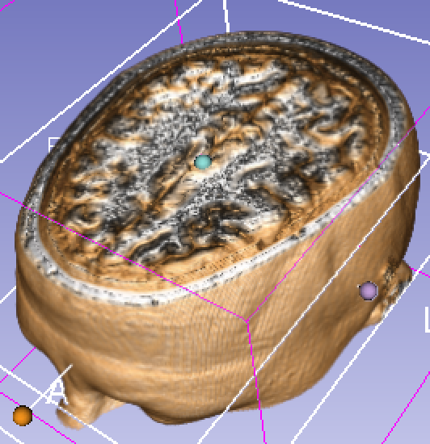
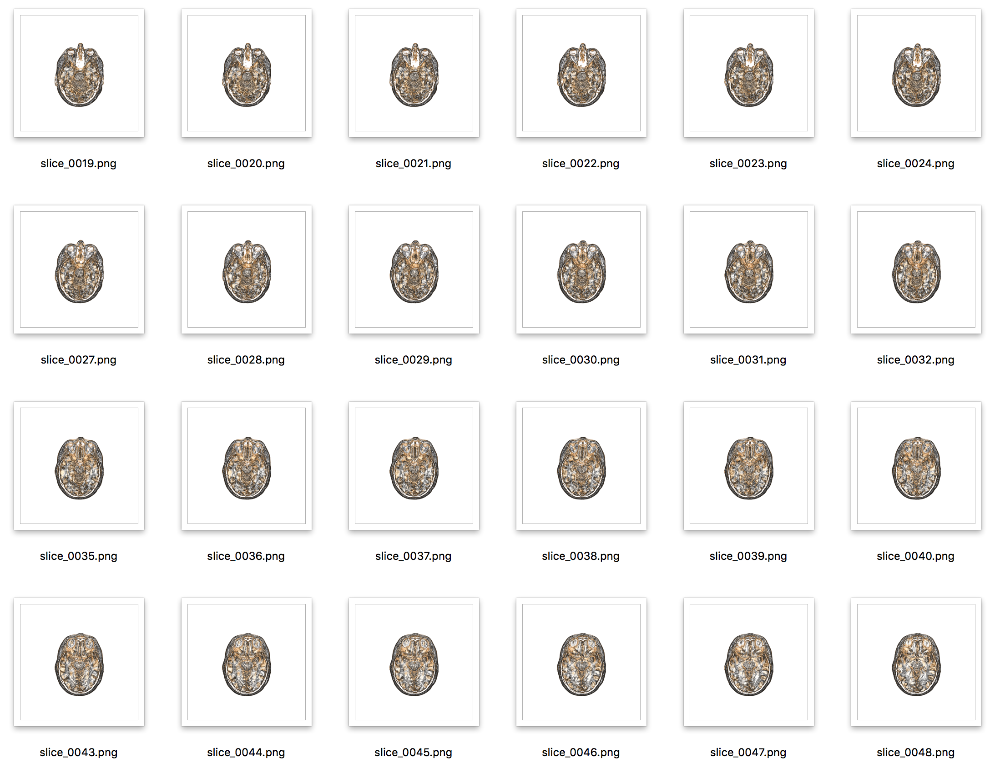

# Process

Turns this:

Into this:

# Usage

2. Install a recent nightly version of [3D Slicer](http://download.slicer.org)
3. Start Slicer, open Extension Manager, and install SlicerFab extension
4. Load data and set up Volume Rendering (see docs and examples at [slicer.org](http://slicer.org)
5. Select the BitmapGenerator module
6. Set the output path (/tmp by default, for windows change to c:/TEMP or something)
7. Click Apply and let the slices get generated.

More info:[paper](https://www.liebertpub.com/doi/pdf/10.1089/3dp.2017.0140), [discussion](https://discourse.slicer.org/t/printing-volume-renderings-in-plastic/3017)

Work in Progress - Please use with caution and add improvements if you can.
